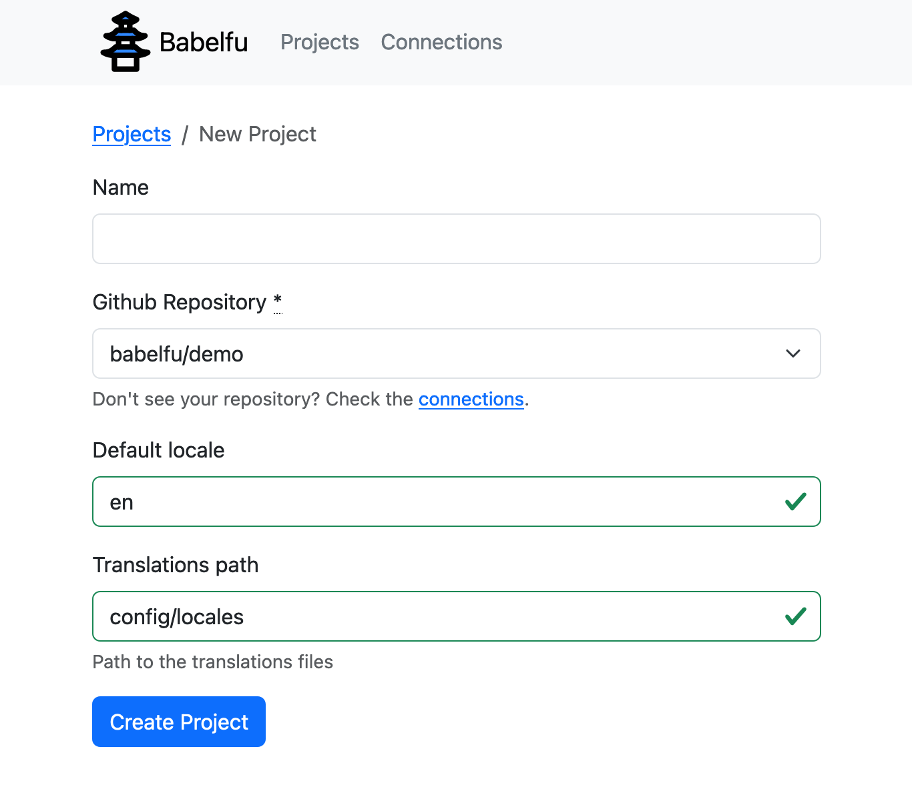
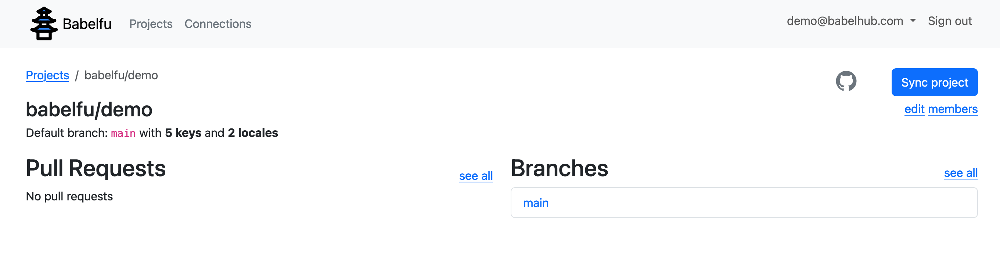
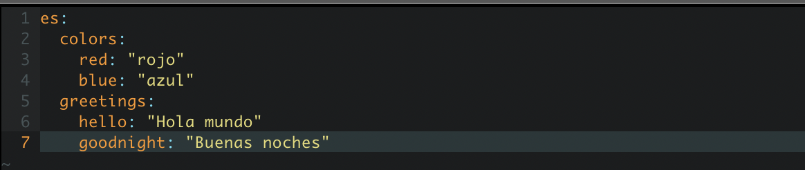
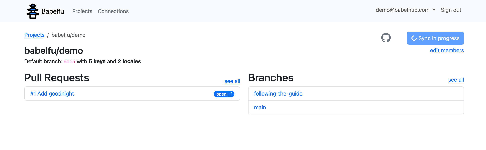
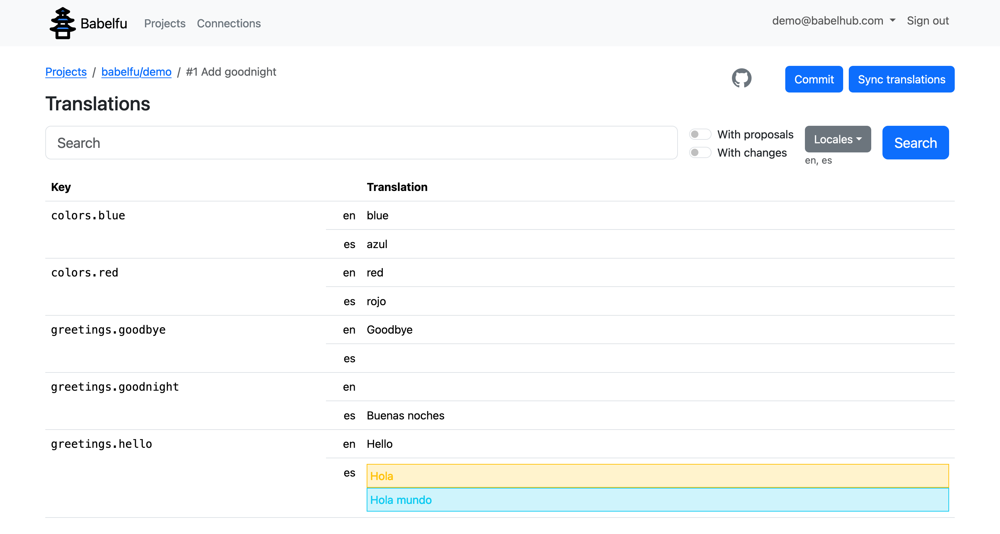
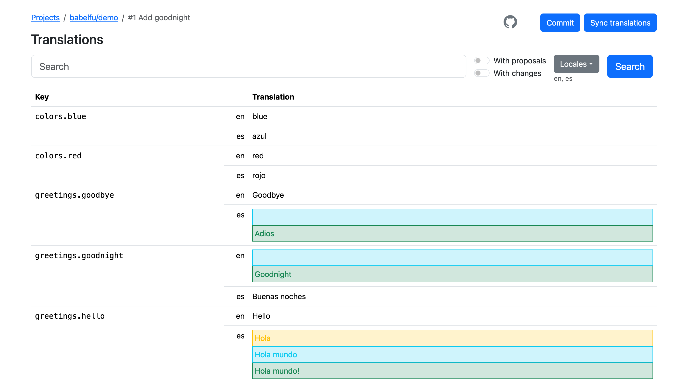
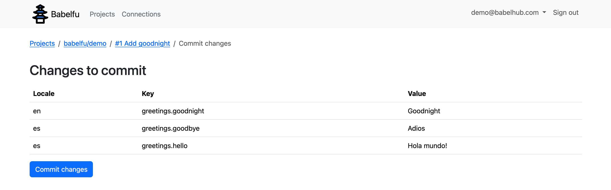
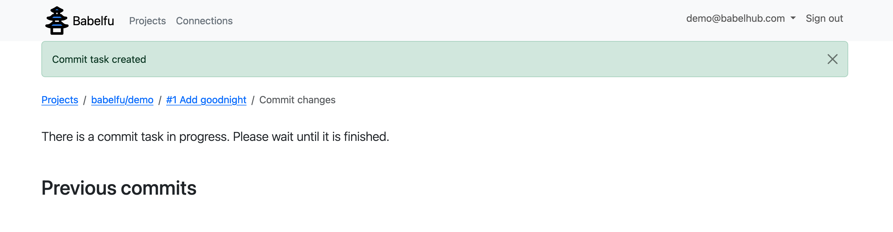
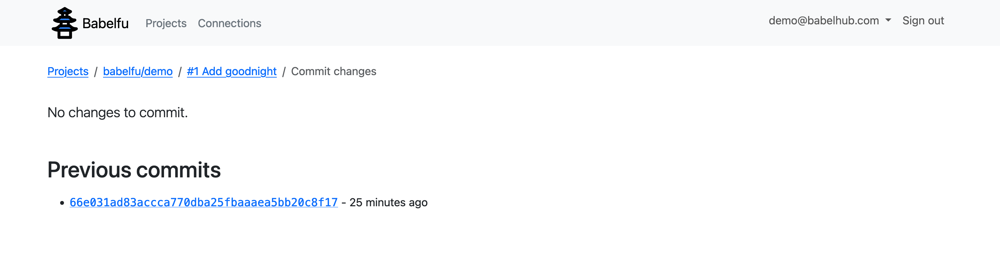
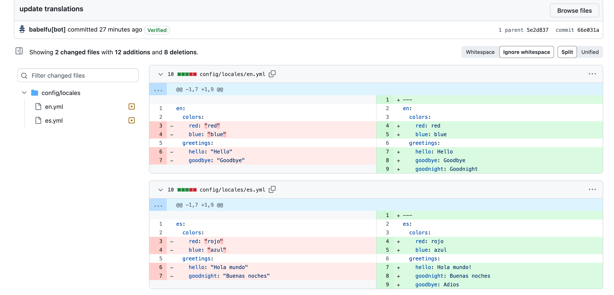

# Demo repository for Babelfu

I am writing this demo guide to show Babelfu's core functionality. Babelfu is still a work in progress, its interface may seem obvious to me, but it might not be as intuitive for the user. Users may encounter corner cases that I have not considered or deliberately avoided to expedite the development of a proof of concept. This guide aims to bridge that gap and ensure you do not get lost and experience what I really want to show.

## The demo guide

Before starting, I recommend forking this repository. It has some translations in the Rails I18n format, which is the only one that Babelfu can handle at the moment. Of course, you can test it with any other repo, but you may find some unexpected issues.

Visit [babelfu.com](https://babelfu.com) and create an account. It only ask for an email and a password to keep it simple. I will not even send you a confirmation email.

Once logged in, you can create a new "Project." This will redirect you to the "Connections" page, where you can connect your GitHub account.

On Github, authorize Babelfu to access some of your repositories. To continue with the guide, at least select the forked repository.

Now you can create a new Project for real. You can leave the "name" empty, select the repository, leave the default locale and translations path with the default values, and click "Create Project".

You will be redirected to the "Project" page. The project will start syncing immediately, fetching the branches and opening pull requests. Now, you can invite other people to the project who can collaborate without a GitHub account.

Babelfu allows the exploration and modification of the translations by branch or pull request. While you can modify the translations for a branch directly, I recommend modifying the translations in an existing pull request as you would in a normal code change. In the future, I would like to:
    - Create a pull request from the UI.
    - Configure if we allow the modification of the translations directly in the branch.

Go to your repository and create a new pull request, for example:

Return to Babelfu and click "Sync translations" to fetch the changes. In the future, it will listen to the GitHub events to sync automatically. You can click on the new pull request as soon as you see it. (Don't wait until the "Sync in progress" finish; it may be quite buggy)

Once on the translations view, check the "Locales" dropdown to select the languages you want to see. You can filter the translations using the "With proposals" and "With changes" toggles. I must rethink the behaviour in conjunction with the "Locales" dropdown and click "Search" to apply the changes. Of course, you can filter the translations by key.

When there are changes, they will appear in different colours (something that needs to be improved), yellow for the value in the base branch, blue the value in the head branch, and green the proposals pending to be commited on Babelfu.

Try editing several translations, for example:

Once you are happy with the changes, click "Commit changes". On the "Commits view," you will see a preview of the changes (another view for improving) and the previous commits. Click "Commit changes" to commit the changes for real.

The commit process will sync the branches again; try to commit the changes and sync the branches again.

Finally, you will see a link to the commit, and no changes are pending.

If you follow the link, you can see the commit on GitHub. This commit contains the new keys and values.

And that's all. That's the main feature of Babelfu; the rest may come later, depending on the people's interest. 
Many thanks for giving it an opportunity and completing the guide. Any feedback will be welcome!
