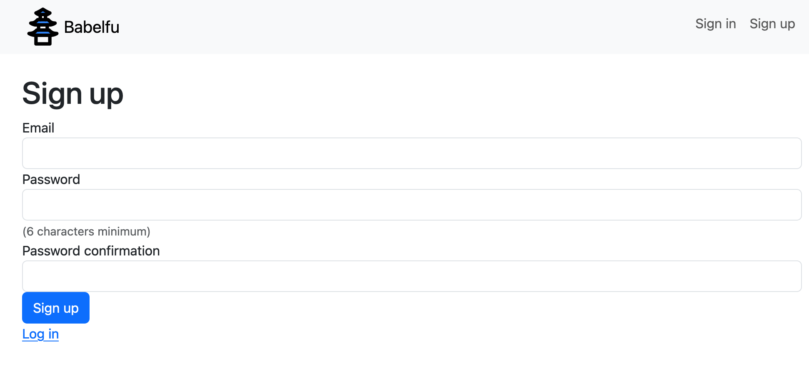
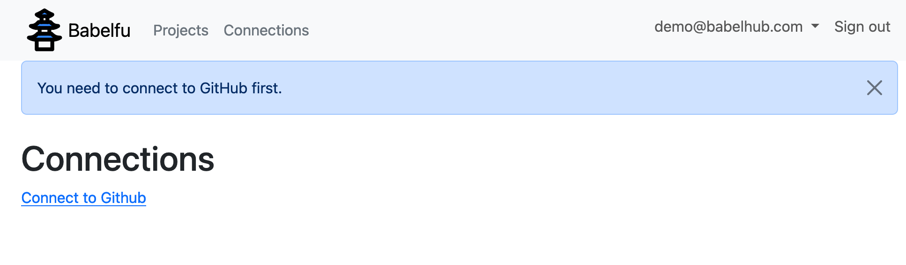
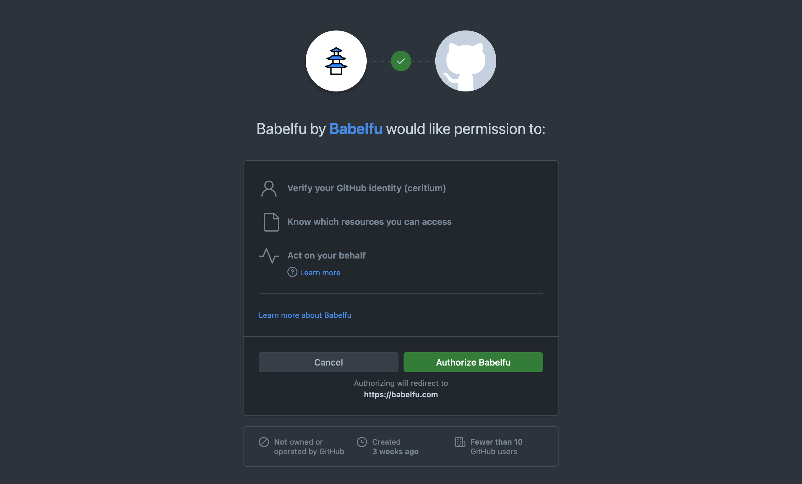

# Demo repository for Babelfu

I am writing an introduction for Babelfu to clarify and guide its users. Although Babelfu is still a work in progress, its interface may seem obvious to me; it might not be as intuitive for the user. This introduction aims to bridge that gap and ensure a smoother user experience.

Users may encounter corner cases that I have not considered or deliberately avoided to expedite the development of a proof of concept. 
I hope to help users navigate Babelfu more effectively by outlining the key functionalities and potential limitations.

## Getting started

Before starting, I recommend forking this repository. It will increase its popularity 📈 and allow you to use it inside Babelfu.

Visit [babelfu.com](https://babelfu.com) and create an account. To keep it simple, I only ask for an email and a password. I will not even send you a confirmation email.

Once you are logged in, you can create a new "Project." This will redirect you to the "Connections" page, where you can connect your GitHub account.

On Github, authorize Babelfu to access some of your repositories. At least select the forked repository to continue with the guide.

Now you can create a new Project for real. You can leave the "name" empty, select the repository, leave the default locale and translations path with the default values, and click "Create Project".

You will be redirected to the "Project" page. The project will start syncing immediately, fetching the branches and opening pull requests.

Babelfu allows the exploration and modification of the translations by branch or pull request. While you can modify the translations for a branch directly, I recommend modifying the translations in an existing pull request as you would in a normal code change. In the future, I would like to:
    - Create a pull request from the UI.
    - Configure if we allow the modification of the translations directly in the branch.
    
Go to your repository and create a new pull request, for example:

Return to Babelfu and click "Sync translations" to fetch the changes. In the future, it will listen to the GitHub events to sync automatically. You can click on the new pull request as soon as you see it. (Don't wait until the "Sync in progress" finish; it may be quite buggy)

Once on the translations view, check the "Locales" dropdown to select the languages you want to see. You can filter the translations using the "With proposals" and "With changes" toggles. I must rethink the behaviour in conjunction with the "Locales" dropdown and click "Search" to apply the changes. Of course, you can filter the translations by key.

When there are changes, they will appear in different colours (something that needs to be improved), yellow for the value in the base branch, blue the value in the head branch, and green the proposals pending to commit on Babelfu.

Try editing several translations, for example:

Once you are happy with the changes, click "Commit changes". On the "Commits view," you will see a preview of the changes (another view for improving) and the previous commits. Click "Commit changes" to commit the changes for real.

The commit process will sync the branches again, try to commit the changes and sync the branches again

